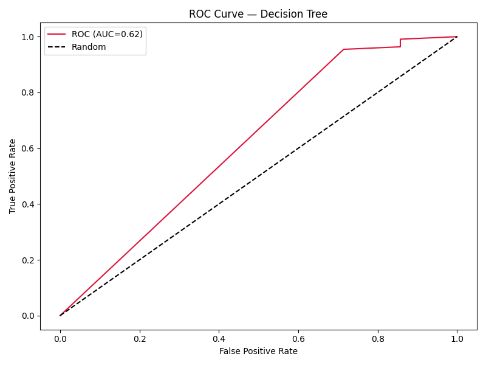
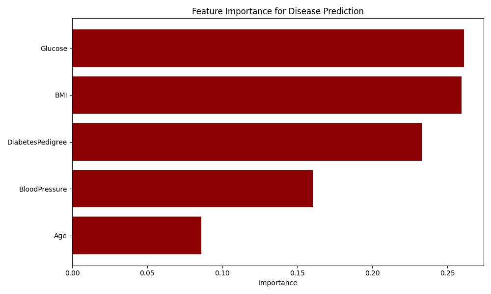

<div align="center">


</div>

---

## Overview

This is the **Month 2 Final Project** — and the **capstone of the entire CloudExify Data Science Internship 2026**. It's a binary classification project predicting disease presence from clinical features (Age, Blood Pressure, Glucose, BMI, Diabetes Pedigree), comparing **Logistic Regression** against a **Decision Tree Classifier**.

|---|---|
|---|---|
| **Type** | Binary Classification (Supervised ML) |
| **Difficulty** | Advanced |
| **Language** | Python (Jupyter Notebook) |
| **Key Libraries** | scikit-learn, pandas, matplotlib |
| **Time Invested** | 12–14 hours |
| **Submission** | End of Month 2 — Final |

---

## Repository Structure

> This is the **final internship submission** — it consolidates all four Data Science projects into one repo.

```
cloudexify-ds-p4-final-MuhammadAhmadHamim/
├── charts/     # Output visuals
|   ├── feature_importance.png
|   └── roc_curve.png
|
├── sales_analysis.ipynb    # Project 1 — Sales Data Analysis
├── customer_segmentation.ipynb     # Project 2 — Customer Segmentation
├── house_price_prediction.ipynb    # Project 3 — House Price Prediction
├── disease_prediction.ipynb    # Project 4 — Disease Prediction (this project)
├── sample_data.csv     # Dataset for Project 1
├── customer_transactions.csv   # Dataset for Project 2
├── house_prices.csv    # Dataset for Project 3
├── disease_data.csv    # Dataset for Project 4
├── sales_analysis_evaluation_report.pdf    # Report file for Project 1
├── customer_segmentation_evaluation_report.pdf     # Report file for Project 2
├── house_price_evaluation_report.pdf   # Report file for Project 3
├── disease_prediction_evaluation_report.pdf    # Report file for Project 4
└── README.md
```

---

## What This Project Covers

- **Data Preprocessing** — missing value handling, feature/target separation, class balance check
- **Stratified Train/Test Split** — 80/20 split preserving class ratio
- **Feature Scaling** — `StandardScaler` for Logistic Regression
- **Logistic Regression** — baseline binary classifier
- **Decision Tree Classifier** — comparison model (max depth 5)
- **Classification Metrics** — Accuracy, Precision, Recall, F1-Score
- **Confusion Matrix & ROC Curve** — visual error analysis and AUC
- **Feature Importance** — identifying the strongest clinical predictors
- **New Patient Prediction** — live inference with probability output

---

## Model Results

| Metric | Score |
|---|---|
| Accuracy | 94.9% |
| Precision | 96.4% |
| Recall | 98.2% |
| F1-Score | 0.973 |

**Dataset composition:** 585 records — 550 Disease (94.0%), 35 Healthy (6.0%).

> ⚠️ **Note on accuracy:** given the strong class imbalance (94% Disease), accuracy alone is not a reliable performance signal — a model predicting "Disease" for everyone would already score ~94%. Precision and recall are the more meaningful metrics here, and both scored strongly.

**Top 3 predictive features:** Glucose (26.1%), BMI (25.9%), DiabetesPedigree (23.3%) — together accounting for ~75% of the model's decision-making.

---

## Sample Outputs

<div align="center">

| ROC Curve | Feature Importance |
|---|---|
|  |  |

</div>

---

## How to Run

```bash
# 1. Clone the repo
git clone https://github.com/MuhammadAhmadHamim/cloudexify-ds-p4-final-MuhammadAhmadHamim.git

# 2. Install dependencies
pip install jupyter pandas numpy matplotlib scikit-learn

# 3. Launch any notebook
jupyter notebook disease_prediction.ipynb
```

Run all cells top to bottom — the ROC curve and feature importance charts each save as `.png` for demonstration.

---

## Testing Checklist

| Test Case | Status |
|---|---|
| Disease dataset loaded, classes shown | ✅ |
| Class balance checked | ✅ |
| Train/test split (80/20, stratified) | ✅ |
| Logistic Regression accuracy > 0.8 | ✅ |
| Decision Tree evaluated vs Logistic | ✅ |
| Confusion matrix generated | ✅ |
| ROC curve plotted | ✅ |
| Feature importance shown | ✅ |
| New patient prediction + probability | ✅ |

---

## Internship Summary

| Project | Domain | Technique |
|---|---|---|
| 1. Sales Data Analysis | EDA | pandas, visualization |
| 2. Customer Segmentation | Unsupervised ML | RFM + K-Means |
| 3. House Price Prediction | Regression | Linear Regression, Random Forest |
| 4. Disease Prediction | Classification | Logistic Regression, Decision Tree |

---

<div align="center">

**CloudExify Summer Internship 2026** · Data Science Track · Final Submission


</div>